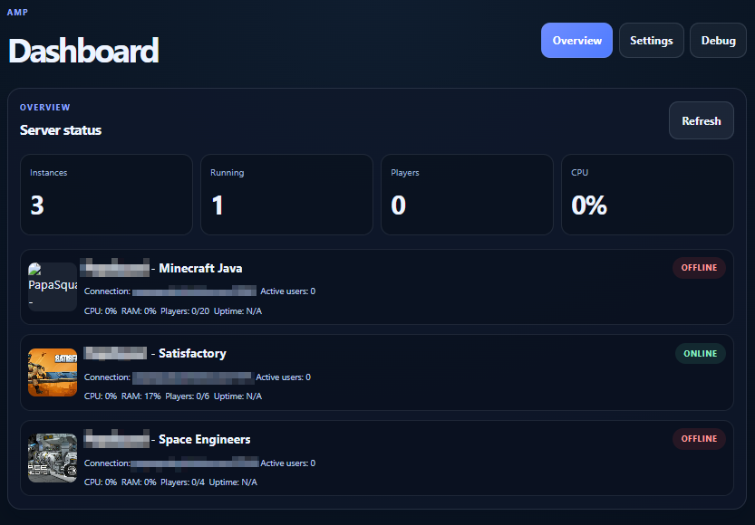
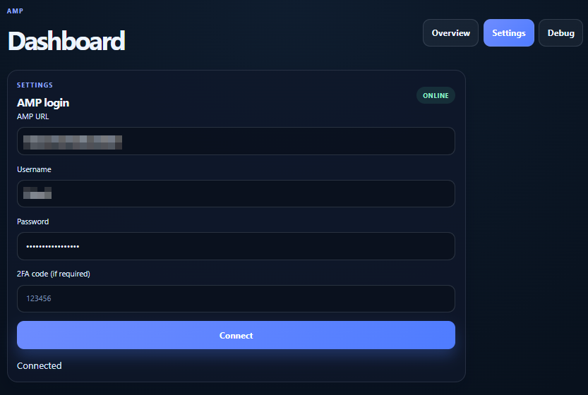
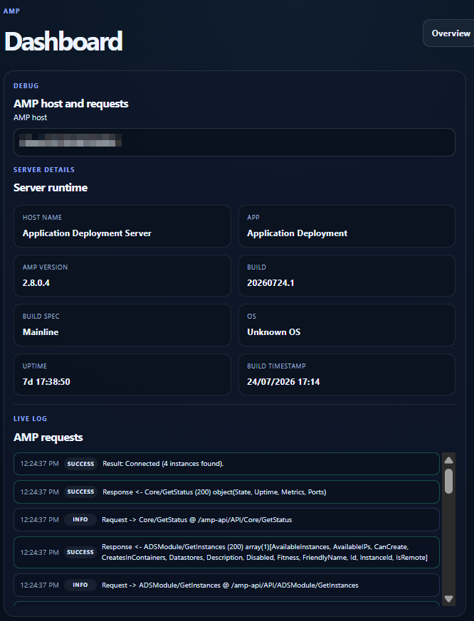

# AMP Dashboard

A mobile-first AMP operations dashboard designed for quick status checks, one-tap access to the most-used AMP routes, and a cleaner management workflow on a phone.

## Purpose

This project is meant to provide a better front door to AMP than navigating a large website on a small screen. The app is built around:

- saved AMP server profiles
- favorite routes to common pages
- quick access to instance and config screens
- a polished mobile dashboard with operational summary cards
- configuration that is entered on-device instead of baked into the codebase

## Current status

This repository currently contains the initial V1 dashboard shell:

- dashboard summary cards
- server profile management
- favorites management
- route generation from a base AMP URL
- responsive styling for phone use
- GitHub-safe repo hygiene

NOTE: This isn't fully feature or UX complete. There are some limitations of AMP that I have to work to overcome to make this better and more useful than just logging into AMP. 2FA is causing some lag issues, and limitations. This is a functioning tool, but not feature complete or significantly useful over the main AMP site. 

I still think it is neat though.

## Screenshots

### Dashboard



### Settings



### Debug



The preview images are included as a visual reference for the three main app views. They are not loaded by the application at runtime.

## Stack

- React + TypeScript
- Vite
- local browser storage for app settings and favorites
- mobile-focused UI designed to feel like an operations dashboard

## Key design principles

### 1. No hardcoded hostnames

The app does not ship with personal LAN IPs or remote AMP hostnames in the repository. Profiles are configured by the user on-device.

### 2. Favorites-first navigation

Users are not expected to drill through dozens of AMP pages. The design prioritizes pinned shortcuts like:

- Instances
- Specific instance overview
- Satisfactory configuration
- Backup or logs pages as needed

### 3. Strong mobile UX

The dashboard is designed to feel like an operations tool, not a generic dashboard template. It favors strong hierarchy, compact cards, and low-friction actions.

### 4. GitHub-safe project hygiene

No production hostnames, secrets, or local-only notes are meant to be committed.

## Example AMP routes

These are the kinds of route patterns the app is designed to support:

- base-url + /instances
- base-url + /instances/{instanceId}
- base-url + /instances/{instanceId}/configuration/{configName}

The application generates these route URLs dynamically from the profile base URL plus a route path.

## Project structure

```text
amp-dashboard/
├── README.md
├── .gitignore
├── .git/info/exclude
├── package.json
├── index.html
├── src/
│   ├── App.tsx
│   ├── App.css
│   ├── index.css
│   ├── main.tsx
│   └── assets/
├── public/
├── docs/
│   ├── ARCHITECTURE.md
│   ├── ROUTES_AND_FAVORITES.md
│   └── IMPLEMENTATION_NOTES.md
├── .env.example
└── dist/   (generated after build)
```

## Local development

```bash
npm install
npm run dev
```

Then open the Vite app in the browser and use the dashboard UI.

For AMP hosts that do not allow browser cross-origin requests, create a local `.env` file from `.env.example`, set `VITE_AMP_PROXY_TARGET` to the AMP host, and restart Vite after changing it. The `.env` file is ignored and must not be committed.

## Production build

```bash
npm run build
```

## Repository hygiene

This repository uses:

- a project-level .gitignore for build artifacts, local environment files, and editor metadata
- runtime configuration for AMP hosts instead of hardcoded server addresses
- a policy of not committing private endpoints or credentials


## Roadmap

### V1 goals

- mobile AMP dashboard
- saved profiles
- quick favorite routes
- clean status cards
- configurable runtime host values
- polished UI without hardcoded IPs

### V2 goals

- background checks and health polling
- downtime and recovery detection
- Android notification support
- alert deduplication and status history
- save-window or interruption awareness for critical game servers

## Important implementation note

This repo is intentionally built to support a clean mobile AMP launcher and dashboard workflow, not a full AMP replacement backend. The product strategy is to make the existing AMP web flows easier to reach and easier to manage from a phone.
